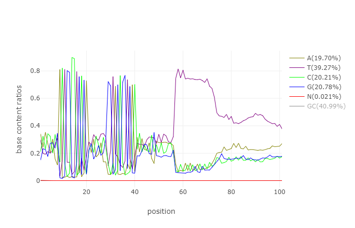

# BD Rhapsody Sequence Reads Exploration

## 数据来源

> Yoon, Se-Jin et al. 2019. “Reliability of Human Cortical Organoid Generation.” Nature Methods 16(1): 75–78.

仅仅从 ENA 下载了 SRP126273 中的 SRR6354915


## Reads Quality and Features

BD Rhapsody 官方手册写明了质量控制的步骤：

1. Read pairs with *low sequencing quality* are first removed.

### fastp 工具

使用 `fastp` 来评估 reads 质量。对于 R1 来说，低质量的 reads 应该直接丢弃，而不是trim头尾。

```
mkdir -p results/quality_control
mkdir -p results/quality_control/trimmed_reads
fastp \
    -h results/quality_control/quality.html \
    -j results/quality_control/quality.json \
    -i data/reads/SRR6354915_R1_.fastq.gz \
    -I data/reads/SRR6354915_R2_.fastq.gz \
    -o results/quality_control/trimmed_reads/SRR6354915_R1_trimmed.fastq.gz \
    -O results/quality_control/trimmed_reads/SRR6354915_R2_trimmed.fastq.gz

seqkit seq -s data/reads/SRR6354915_R1_.fastq.gz | fa-less
```

`fastp` 无法分别针对 R1 或者 R2 进行最小长度控制。

#### Read 1 Features

R1 的质量和碱基内容如下面两张图所示，从第二幅图可以清楚的看到


从图一可以看到，76 位有个碱基质量跌破谷底，而从图二看起来 76 位正好是 polyT 结束的位置。



从图二可以清楚的看到 9 - 20 区间是 L1 片段 `ACTGGCCTGCGA`，从 29 - 40 区间是 L2 片段 `GGTAGCGGTGAC` 。从 57 位开始这是 polyT 。

#### Read 2 Features

R2 在 51 位也存在一个质量下滑。


### Trimmomatic 工具

好像也不能针对单独的 R1 或者 R2 控制最小长度。